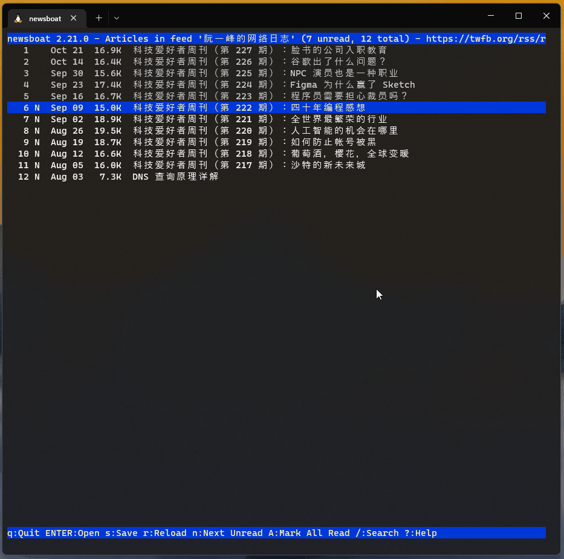

# Wasteland



# INSTALL
1. install [tiv](https://github.com/stefanhaustein/TerminalImageViewer) and [newsboat](https://newsboat.org/)
2. `cp -r wasteland ~/.newsboat/wasteland`
3. config newsboat `vim ~/.newsboat/config`
```
html-renderer "cat"
pager "~/.newsboat/wasteland/render.py %f && ~/.newsboat/wasteland/viewer.py"
browser "w3m"
```
# FEATURE
1. show images in terminal
2. parse qr code

# BUG
1. Abnormal Chinese display

